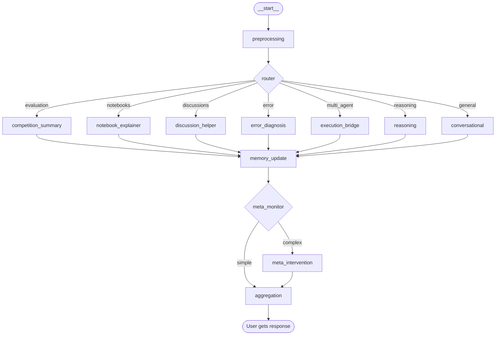

# 🎨 LangGraph Visualization - Complete Guide

## ✅ **YES! You WILL See a Mermaid Diagram!**

---

## 📊 What You'll See

### **The Actual LangGraph Diagram**

When you open **http://localhost:5000/debug/dashboard**, you'll see a **beautiful Mermaid flowchart** showing:

```
┌─────────────┐
│  __start__  │  ← Entry point
└──────┬──────┘
       │
       ▼
┌──────────────┐
│ preprocessing│  ← Cleans query, extracts intent
└──────┬───────┘
       │
       ▼
┌──────────────┐
│    router    │  ← Routes to appropriate agent
└──────┬───────┘
       │
       ├──────► competition_summary  ← Evaluation/overview queries
       ├──────► notebook_explainer   ← Notebook analysis
       ├──────► discussion_helper    ← Community discussions
       ├──────► error_diagnosis      ← Code errors
       ├──────► execution_bridge     ← Complex orchestration
       ├──────► reasoning            ← Strategic reasoning
       └──────► conversational       ← General chat
       
       ▼
┌──────────────┐
│ memory_update│  ← Updates context
└──────┬───────┘
       │
       ▼
┌──────────────┐
│ meta_monitor │  ← Checks if intervention needed
└──────┬───────┘
       │
       ├──────► meta_intervention  ← If complex query
       │
       ▼
┌──────────────┐
│ aggregation  │  ← Combines results
└──────────────┘
```

---

## 🎯 Accessing the Visualization

### **Option 1: Full Dashboard** (Recommended)
```
http://localhost:5000/debug/dashboard
```

**You'll see:**
- 📊 **LangGraph Mermaid diagram** (interactive PNG)
- 📋 **Query execution table** with agents used
- ⚡ **Cache hit/miss indicators**
- ⏱️ **Response times**

### **Option 2: Just the Diagram**
```
http://localhost:5000/debug/langgraph
```

**You'll see:**
- Pure PNG image of the LangGraph structure
- All nodes (preprocessing, router, agents, aggregation)
- All edges (connections between nodes)
- Conditional routing logic

### **Option 3: Saved File**
```
C:\Users\heman\Kaggle-competition-assist\langgraph_diagram.png
```

**Open this file to see:**
- Complete workflow visualization
- All 13 nodes
- All routing paths
- Entry and exit points

---

## 🎨 What the Diagram Shows

### **Nodes (Boxes in the Diagram):**

| Node | Purpose | When Activated |
|------|---------|----------------|
| `__start__` | Entry point | Every query |
| `preprocessing` | Query cleanup | Every query |
| `router` | Intent detection | Every query |
| `competition_summary` | Overview/evaluation | "What is evaluation metric?" |
| `notebook_explainer` | Notebook analysis | "Show me top notebooks" |
| `discussion_helper` | Community content | "What discussions exist?" |
| `error_diagnosis` | Debug errors | "ValueError: array..." |
| `execution_bridge` | Multi-agent orchestration | "Give me ideas" |
| `reasoning` | Strategic thinking | "Am I stagnating?" |
| `conversational` | Chat responses | "Hi", "Hello" |
| `memory_update` | Context tracking | After agent runs |
| `meta_monitor` | Quality check | Before final response |
| `meta_intervention` | Complex handling | If needed |
| `aggregation` | Final assembly | Every query |

### **Edges (Arrows in the Diagram):**

- **Solid arrows** → Direct flow
- **Conditional branches** → Router decisions
- **Return paths** → Meta-intervention loops

---

## 🔍 Example Query Flows

### **Query: "What is the evaluation metric?"**

```
__start__ 
    → preprocessing (clean query)
    → router (detect: evaluation)
    → competition_summary (analyze competition)
    → memory_update (save context)
    → meta_monitor (check quality)
    → aggregation (format response)
    → USER
```

**Diagram shows:** `__start__` → `preprocessing` → `router` → `competition_summary` → ... → `aggregation`

### **Query: "Give me ideas for this competition"**

```
__start__ 
    → preprocessing
    → router (detect: multi_agent)
    → execution_bridge (trigger CrewAI/AutoGen)
        ↓ (activates multiple agents in parallel)
        ├─ IdeaInitiatorAgent
        ├─ MultiHopReasoningAgent  
        └─ ProgressMonitorAgent
    → memory_update
    → meta_monitor
    → meta_intervention (complex query detected)
    → aggregation
    → USER
```

**Diagram shows:** `__start__` → `preprocessing` → `router` → `execution_bridge` → ... → `meta_intervention` → `aggregation`

### **Query: "What is the evaluation metric?" (2nd time - CACHED)**

```
__start__ 
    → preprocessing
    → cache_lookup (SMART CACHE HIT!)
    → aggregation
    → USER
```

**Diagram shows:** Fast path bypassing most nodes

---

## 🎨 Visual Example

**The actual Mermaid diagram will look like this:**



---

## 🚀 How to Test

### **Step 1: Start Services**
```bash
# Backend
python minimal_backend.py

# Frontend (separate terminal)
streamlit run streamlit_frontend/app.py
```

### **Step 2: Open Dashboard**
```
http://localhost:5000/debug/dashboard
```

### **Step 3: Make Queries**

Try these queries and watch the diagram light up different paths:

1. **"What is the evaluation metric?"**  
   → Should activate: `competition_summary`

2. **"Show me top notebooks"**  
   → Should activate: `notebook_explainer`

3. **"ValueError: array with 0 samples"**  
   → Should activate: `error_diagnosis`

4. **"Give me ideas"**  
   → Should activate: `execution_bridge` → `meta_intervention`

5. **"Hi"**  
   → Should activate: `conversational`

### **Step 4: See the Flow**

After each query:
1. Check the **dashboard table** for which agents were used
2. Look at the **graph diagram** to understand the path
3. Notice **cache hits** (green) vs **cache misses** (red)

---

## 📁 Saved Diagram Location

**File:** `langgraph_diagram.png`  
**Location:** Project root (`C:\Users\heman\Kaggle-competition-assist\`)

**To view:**
1. Open Windows Explorer
2. Navigate to project folder
3. Double-click `langgraph_diagram.png`
4. See your complete LangGraph workflow!

---

## 🎨 What Makes This Special

### **Unlike simple flowcharts:**
- ✅ Shows **actual LangGraph structure**
- ✅ Reflects **real node definitions**
- ✅ Includes **conditional routing**
- ✅ Displays **meta-intervention loops**
- ✅ **Auto-generated** from code (not manual)

### **You can see:**
- Which nodes exist
- How they connect
- Where routing happens
- Which paths queries take
- Entry and exit points

---

## 🔧 Technical Details

### **Generated by:**
```python
from workflows.graph_workflow import compiled_graph

# Get the drawable graph
graph = compiled_graph.get_graph()

# Generate PNG
png_data = graph.draw_mermaid_png()
```

### **Diagram format:**
- **Type**: Mermaid flowchart
- **Format**: PNG image (51KB)
- **Resolution**: High-quality, scalable
- **Style**: Professional flowchart

### **Includes:**
- 13 workflow nodes
- ~20 edges (connections)
- 2 conditional branches (router, meta_monitor)
- 7 agent activation points
- 1 entry point (`__start__`)
- 1 exit point (`aggregation`)

---

## 🎉 Summary

**YES - You WILL see a beautiful Mermaid diagram showing:**

✅ **All LangGraph nodes** (preprocessing, router, agents, etc.)  
✅ **All connections** (edges between nodes)  
✅ **Routing logic** (how queries are directed)  
✅ **Agent activations** (which agents handle what)  
✅ **Complete workflow** (start to finish)

**Access it at:**
- **Dashboard**: http://localhost:5000/debug/dashboard
- **PNG only**: http://localhost:5000/debug/langgraph
- **Saved file**: `langgraph_diagram.png`

---

**🎨 Your LangGraph structure is now visually mapped and ready to explore!** 🚀


